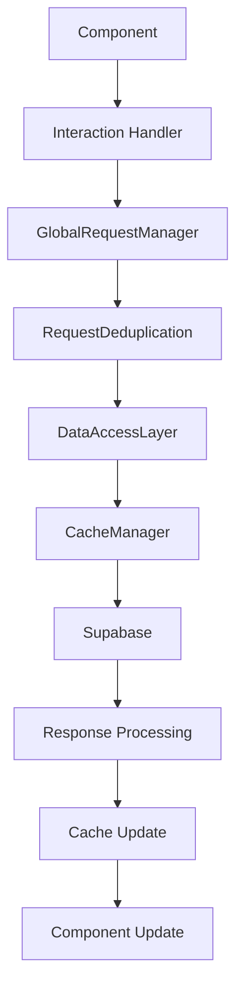

# TECHNICAL ARCHITECTURE REDESIGN v1.0.0

> **Comprehensive Technical Specification for Unified Architecture**  
> Detailed implementation guide for architectural transformation  
> Last Updated: 2025-06-13

---

## 🎯 ARCHITECTURE TRANSFORMATION OVERVIEW

### Current State Analysis
**Problems**: Fragmented systems, 72+ API requests, 8+ overlapping performance hooks, no centralized coordination
**Solution**: Unified architecture with single-source-of-truth systems and coordinated request management
**Outcome**: <10 API requests, unified systems, scalable architecture foundation

---

## 🏗️ CORE ARCHITECTURE COMPONENTS

### 1. Global Request Coordination System

#### GlobalRequestManager
**File**: `src/core/GlobalRequestManager.ts`
**Purpose**: Single entry point for all API requests across the application

```typescript
interface RequestOperation<T = any> {
  key: string;
  operation: () => Promise<T>;
  priority: 'critical' | 'normal' | 'background';
  cacheTTL?: number;
  retryPolicy?: RetryPolicy;
}

interface RequestMetrics {
  totalRequests: number;
  requestsPerSecond: number;
  averageResponseTime: number;
  cacheHitRate: number;
  errorRate: number;
}

class GlobalRequestManager {
  private requestRegistry: Map<string, Promise<any>>;
  private requestMetrics: RequestMetrics;
  private deduplicationLayer: RequestDeduplication;
  private rateLimiter: RateLimiter;
  
  async executeRequest<T>(operation: RequestOperation<T>): Promise<T> {
    // 1. Check deduplication cache
    // 2. Apply rate limiting
    // 3. Execute request with monitoring
    // 4. Update metrics and cache
    // 5. Handle errors with retry logic
  }
  
  getRequestMetrics(): RequestMetrics {
    // Real-time request analytics
  }
  
  optimizeRequestPattern(pattern: RequestPattern): void {
    // Intelligent request optimization
  }
}
```

#### RequestDeduplication
**File**: `src/core/RequestDeduplication.ts`
**Purpose**: Prevent duplicate API requests across components

```typescript
interface RequestFingerprint {
  endpoint: string;
  parameters: Record<string, any>;
  hash: string;
}

class RequestDeduplication {
  private pendingRequests: Map<string, Promise<any>>;
  private requestCache: Map<string, CachedResponse>;
  
  async deduplicateRequest<T>(
    fingerprint: RequestFingerprint,
    requestFn: () => Promise<T>
  ): Promise<T> {
    const key = fingerprint.hash;
    
    // Return pending request if exists
    if (this.pendingRequests.has(key)) {
      return this.pendingRequests.get(key);
    }
    
    // Return cached response if valid
    const cached = this.requestCache.get(key);
    if (cached && this.isCacheValid(cached)) {
      return cached.data;
    }
    
    // Execute new request
    const promise = requestFn();
    this.pendingRequests.set(key, promise);
    
    promise.finally(() => {
      this.pendingRequests.delete(key);
    });
    
    return promise;
  }
}
```

### 2. Unified Data Layer

#### DataAccessLayer
**File**: `src/core/DataAccessLayer.ts`
**Purpose**: Standardized interface for all data operations

```typescript
interface DataOperation {
  type: 'query' | 'mutation' | 'subscription';
  resource: string;
  parameters?: Record<string, any>;
  cacheKey?: string;
}

interface DataResponse<T> {
  data: T;
  error: Error | null;
  loading: boolean;
  fromCache: boolean;
}

class DataAccessLayer {
  private requestManager: GlobalRequestManager;
  private cacheManager: CacheManager;
  private errorHandler: ErrorHandler;
  
  async executeOperation<T>(operation: DataOperation): Promise<DataResponse<T>> {
    try {
      const response = await this.requestManager.executeRequest({
        key: this.generateOperationKey(operation),
        operation: () => this.performOperation<T>(operation),
        priority: this.determinePriority(operation),
        cacheTTL: this.getCacheTTL(operation),
      });
      
      return {
        data: response,
        error: null,
        loading: false,
        fromCache: false,
      };
    } catch (error) {
      return this.errorHandler.handleDataError(error, operation);
    }
  }
  
  private async performOperation<T>(operation: DataOperation): Promise<T> {
    // Unified Supabase operation execution
    switch (operation.type) {
      case 'query':
        return this.executeQuery<T>(operation);
      case 'mutation':
        return this.executeMutation<T>(operation);
      case 'subscription':
        return this.executeSubscription<T>(operation);
    }
  }
}
```

#### CacheManager
**File**: `src/core/CacheManager.ts`
**Purpose**: Unified caching strategy across the application

```typescript
interface CacheEntry<T> {
  data: T;
  timestamp: number;
  ttl: number;
  accessCount: number;
  lastAccessed: number;
}

interface CacheStrategy {
  defaultTTL: number;
  maxSize: number;
  evictionPolicy: 'LRU' | 'LFU' | 'TTL';
}

class CacheManager {
  private cache: Map<string, CacheEntry<any>>;
  private strategy: CacheStrategy;
  
  async get<T>(key: string): Promise<T | null> {
    const entry = this.cache.get(key);
    
    if (!entry) return null;
    
    if (this.isExpired(entry)) {
      this.cache.delete(key);
      return null;
    }
    
    entry.accessCount++;
    entry.lastAccessed = Date.now();
    
    return entry.data;
  }
  
  async set<T>(key: string, data: T, ttl?: number): Promise<void> {
    // Implement cache storage with eviction
    this.ensureCacheSpace();
    
    this.cache.set(key, {
      data,
      timestamp: Date.now(),
      ttl: ttl || this.strategy.defaultTTL,
      accessCount: 1,
      lastAccessed: Date.now(),
    });
  }
  
  getCacheStats(): CacheStats {
    // Return cache performance metrics
  }
}
```

### 3. Unified Performance Management

#### PerformanceManager
**File**: `src/core/PerformanceManager.ts`
**Purpose**: Single performance monitoring and optimization system

```typescript
interface PerformanceMetrics {
  requestMetrics: RequestMetrics;
  componentMetrics: ComponentMetrics;
  memoryMetrics: MemoryMetrics;
  userExperienceMetrics: UserExperienceMetrics;
}

interface OptimizationRule {
  condition: (metrics: PerformanceMetrics) => boolean;
  action: (context: OptimizationContext) => Promise<void>;
  priority: number;
}

class PerformanceManager {
  private metricsCollector: MetricsCollector;
  private optimizationEngine: OptimizationEngine;
  private alertSystem: AlertSystem;
  
  startMonitoring(): void {
    // Initialize comprehensive performance monitoring
    this.metricsCollector.start();
    this.optimizationEngine.start();
    this.alertSystem.start();
  }
  
  collectMetrics(): PerformanceMetrics {
    return {
      requestMetrics: this.collectRequestMetrics(),
      componentMetrics: this.collectComponentMetrics(),
      memoryMetrics: this.collectMemoryMetrics(),
      userExperienceMetrics: this.collectUXMetrics(),
    };
  }
  
  async optimizePerformance(): Promise<OptimizationResult> {
    const metrics = this.collectMetrics();
    const optimizations = this.optimizationEngine.analyze(metrics);
    
    for (const optimization of optimizations) {
      await this.applyOptimization(optimization);
    }
    
    return this.generateOptimizationReport(optimizations);
  }
}
```

---

## 🔧 COMPONENT ARCHITECTURE PATTERNS

### 1. Data Provider Pattern

#### Page-Level Data Providers
```typescript
// src/providers/DashboardDataProvider.tsx
interface DashboardData {
  issues: Issue[];
  userInteractions: UserInteractionMap;
  sectionVisibility: SectionVisibility[];
  featuredIssue: Issue | null;
}

const DashboardDataProvider: React.FC<{ children: ReactNode }> = ({ children }) => {
  const dataAccessLayer = useDataAccessLayer();
  
  const { data, loading, error } = useUnifiedQuery({
    queryKey: ['dashboard-data'],
    queryFn: async (): Promise<DashboardData> => {
      // Single coordinated data fetch for entire dashboard
      const [issues, userInteractions, sectionVisibility, featuredIssue] = 
        await Promise.all([
          dataAccessLayer.executeOperation({
            type: 'query',
            resource: 'issues',
            parameters: { published: true, limit: 50 }
          }),
          dataAccessLayer.executeOperation({
            type: 'query',
            resource: 'user-interactions',
            parameters: { userId: currentUser?.id }
          }),
          dataAccessLayer.executeOperation({
            type: 'query',
            resource: 'section-visibility'
          }),
          dataAccessLayer.executeOperation({
            type: 'query',
            resource: 'featured-issue'
          })
        ]);
      
      return { issues, userInteractions, sectionVisibility, featuredIssue };
    },
    staleTime: 5 * 60 * 1000, // 5 minutes
  });
  
  return (
    <DashboardContext.Provider value={{ data, loading, error }}>
      {children}
    </DashboardContext.Provider>
  );
};
```

### 2. Standardized Component Interface

#### Component Interface Standards
```typescript
// src/types/ComponentInterfaces.ts
interface StandardComponentProps {
  loading?: boolean;
  error?: Error | null;
  className?: string;
}

interface ArticleComponentProps extends StandardComponentProps {
  issue: Issue;
  userInteraction?: UserInteraction;
  onInteraction?: (action: InteractionAction) => void;
  variant?: 'card' | 'carousel' | 'list' | 'featured';
}

interface InteractionAction {
  type: 'bookmark' | 'reaction' | 'share';
  payload: Record<string, any>;
}

// Standardized component implementation
const ArticleCard: React.FC<ArticleComponentProps> = ({ 
  issue, 
  userInteraction, 
  onInteraction,
  variant = 'card',
  loading = false,
  error = null,
  className = ''
}) => {
  // Pure presentation component - no data fetching
  const handleBookmark = useCallback(() => {
    onInteraction?.({
      type: 'bookmark',
      payload: { issueId: issue.id }
    });
  }, [issue.id, onInteraction]);
  
  if (loading) return <ArticleCardSkeleton />;
  if (error) return <ArticleCardError error={error} />;
  
  return (
    <Card className={className} variant={variant}>
      {/* Pure presentation logic */}
    </Card>
  );
};
```

### 3. Interaction Handling System

#### Centralized Interaction Management
```typescript
// src/hooks/useInteractionManager.ts
interface InteractionState {
  bookmarks: Set<string>;
  reactions: Map<string, Set<string>>;
  pending: Set<string>;
}

const useInteractionManager = () => {
  const [state, setState] = useState<InteractionState>({
    bookmarks: new Set(),
    reactions: new Map(),
    pending: new Set(),
  });
  
  const dataAccessLayer = useDataAccessLayer();
  
  const handleInteraction = useCallback(async (action: InteractionAction) => {
    const { type, payload } = action;
    
    // Optimistic update
    setState(prev => optimisticallyUpdate(prev, action));
    
    try {
      // Execute interaction through unified data layer
      await dataAccessLayer.executeOperation({
        type: 'mutation',
        resource: 'user-interaction',
        parameters: { action: type, ...payload }
      });
    } catch (error) {
      // Rollback optimistic update
      setState(prev => rollbackUpdate(prev, action));
      throw error;
    }
  }, [dataAccessLayer]);
  
  return {
    state,
    handleInteraction,
    isBookmarked: (issueId: string) => state.bookmarks.has(issueId),
    hasReaction: (issueId: string, reactionType: string) => 
      state.reactions.get(issueId)?.has(reactionType) ?? false,
  };
};
```

---

## 🔄 DATA FLOW ARCHITECTURE

### 1. Request Flow Pattern



### 2. Component Data Flow

```typescript
// Data flow implementation example
const DashboardFlow = () => {
  // 1. Page-level data provider
  return (
    <DashboardDataProvider>
      {/* 2. Container component receives data */}
      <DashboardContainer />
    </DashboardDataProvider>
  );
};

const DashboardContainer = () => {
  // 3. Data consumer hook
  const { data, loading, error } = useDashboardData();
  const interactionManager = useInteractionManager();
  
  if (loading) return <DashboardSkeleton />;
  if (error) return <DashboardError error={error} />;
  
  // 4. Data distribution to components
  return (
    <div>
      {data.issues.map(issue => (
        <ArticleCard
          key={issue.id}
          issue={issue}
          userInteraction={data.userInteractions[issue.id]}
          onInteraction={interactionManager.handleInteraction}
        />
      ))}
    </div>
  );
};
```

---

## 📊 MONITORING AND ANALYTICS

### 1. Real-time Performance Dashboard

#### Performance Metrics Collection
```typescript
// src/core/MetricsCollector.ts
interface PerformanceSample {
  timestamp: number;
  requestCount: number;
  responseTime: number;
  memoryUsage: number;
  errorCount: number;
  cacheHitRate: number;
}

class MetricsCollector {
  private samples: PerformanceSample[] = [];
  private observers: PerformanceObserver[] = [];
  
  startCollection(): void {
    // Collect Web Vitals
    this.observeWebVitals();
    
    // Collect Request Metrics
    this.observeRequestMetrics();
    
    // Collect Memory Metrics
    this.observeMemoryMetrics();
    
    // Collect Custom Metrics
    this.observeCustomMetrics();
  }
  
  getMetricsSummary(): MetricsSummary {
    return {
      requestsPerSecond: this.calculateRequestsPerSecond(),
      averageResponseTime: this.calculateAverageResponseTime(),
      memoryUsageTrend: this.calculateMemoryTrend(),
      errorRate: this.calculateErrorRate(),
      cacheEfficiency: this.calculateCacheEfficiency(),
    };
  }
}
```

### 2. Performance Alerting System

#### Alert Configuration
```typescript
// src/core/AlertSystem.ts
interface AlertRule {
  id: string;
  condition: (metrics: PerformanceMetrics) => boolean;
  severity: 'low' | 'medium' | 'high' | 'critical';
  message: string;
  action?: () => Promise<void>;
}

const performanceAlerts: AlertRule[] = [
  {
    id: 'high-api-requests',
    condition: (metrics) => metrics.requestMetrics.requestsPerPage > 15,
    severity: 'critical',
    message: 'API request count exceeding target threshold',
  },
  {
    id: 'memory-leak-detected',
    condition: (metrics) => metrics.memoryMetrics.trend === 'increasing',
    severity: 'high',
    message: 'Potential memory leak detected',
  },
  {
    id: 'cache-efficiency-low',
    condition: (metrics) => metrics.cacheMetrics.hitRate < 0.7,
    severity: 'medium',
    message: 'Cache hit rate below optimal threshold',
  }
];
```

---

## 🚨 ERROR HANDLING ARCHITECTURE

### 1. Unified Error Boundary System

#### Global Error Boundary
```typescript
// src/components/error/UnifiedErrorBoundary.tsx
interface ErrorBoundaryState {
  hasError: boolean;
  error: Error | null;
  errorInfo: ErrorInfo | null;
  errorId: string;
}

class UnifiedErrorBoundary extends Component<
  PropsWithChildren<{}>,
  ErrorBoundaryState
> {
  constructor(props: PropsWithChildren<{}>) {
    super(props);
    this.state = {
      hasError: false,
      error: null,
      errorInfo: null,
      errorId: '',
    };
  }
  
  static getDerivedStateFromError(error: Error): Partial<ErrorBoundaryState> {
    return {
      hasError: true,
      error,
      errorId: generateErrorId(),
    };
  }
  
  componentDidCatch(error: Error, errorInfo: ErrorInfo) {
    // Log error to monitoring system
    this.logErrorToMonitoring(error, errorInfo);
    
    // Update state with error info
    this.setState({ errorInfo });
    
    // Attempt automatic recovery for recoverable errors
    this.attemptRecovery(error);
  }
  
  render() {
    if (this.state.hasError) {
      return (
        <ErrorRecoveryComponent
          error={this.state.error}
          errorId={this.state.errorId}
          onRecovery={() => this.recoverFromError()}
        />
      );
    }
    
    return this.props.children;
  }
}
```

### 2. Error Recovery Mechanisms

#### Automatic Error Recovery
```typescript
// src/core/ErrorRecovery.ts
interface RecoveryStrategy {
  canRecover: (error: Error) => boolean;
  recover: (error: Error, context: RecoveryContext) => Promise<RecoveryResult>;
  fallback: () => ReactElement;
}

const recoveryStrategies: RecoveryStrategy[] = [
  {
    canRecover: (error) => error.name === 'NetworkError',
    recover: async (error, context) => {
      // Retry network requests
      await context.retryLastRequest();
      return { success: true, message: 'Network request retried' };
    },
    fallback: () => <NetworkErrorFallback />
  },
  {
    canRecover: (error) => error.name === 'ChunkLoadError',
    recover: async (error, context) => {
      // Reload the page to fetch fresh chunks
      window.location.reload();
      return { success: true, message: 'Page reloaded' };
    },
    fallback: () => <ChunkLoadErrorFallback />
  }
];
```

---

## 📈 SCALABILITY ARCHITECTURE

### 1. Modular System Design

#### Plugin Architecture for Extensions
```typescript
// src/core/PluginSystem.ts
interface Plugin {
  id: string;
  name: string;
  version: string;
  init: (context: PluginContext) => Promise<void>;
  destroy: () => Promise<void>;
}

class PluginSystem {
  private plugins: Map<string, Plugin> = new Map();
  
  async registerPlugin(plugin: Plugin): Promise<void> {
    await plugin.init(this.createPluginContext());
    this.plugins.set(plugin.id, plugin);
  }
  
  private createPluginContext(): PluginContext {
    return {
      requestManager: this.globalRequestManager,
      dataLayer: this.dataAccessLayer,
      performanceManager: this.performanceManager,
    };
  }
}
```

### 2. Feature Flag System

#### Dynamic Feature Management
```typescript
// src/core/FeatureFlags.ts
interface FeatureFlag {
  key: string;
  enabled: boolean;
  conditions?: FeatureCondition[];
  rolloutPercentage?: number;
}

class FeatureFlagManager {
  private flags: Map<string, FeatureFlag> = new Map();
  
  isEnabled(flagKey: string, context?: FeatureContext): boolean {
    const flag = this.flags.get(flagKey);
    if (!flag) return false;
    
    if (!flag.enabled) return false;
    
    if (flag.conditions) {
      return this.evaluateConditions(flag.conditions, context);
    }
    
    if (flag.rolloutPercentage) {
      return this.evaluateRollout(flag.rolloutPercentage, context);
    }
    
    return true;
  }
}
```

---

## 🔧 DEVELOPMENT AND TESTING ARCHITECTURE

### 1. Component Testing Framework

#### Standardized Testing Patterns
```typescript
// src/testing/ComponentTestUtils.ts
interface ComponentTestSetup<T = any> {
  component: ComponentType<T>;
  props: T;
  providers?: ComponentType[];
  mocks?: MockConfiguration;
}

const createComponentTest = <T>({ 
  component: Component, 
  props, 
  providers = [],
  mocks = {}
}: ComponentTestSetup<T>) => {
  const Wrapper = ({ children }: { children: ReactNode }) => {
    return providers.reduce(
      (acc, Provider) => <Provider>{acc}</Provider>,
      children as ReactElement
    );
  };
  
  return {
    render: () => render(<Component {...props} />, { wrapper: Wrapper }),
    mockInteractions: createInteractionMocks(mocks),
    expectBehavior: createBehaviorMatchers(Component),
  };
};

// Usage example
describe('ArticleCard', () => {
  const testSetup = createComponentTest({
    component: ArticleCard,
    props: { issue: mockIssue, userInteraction: mockInteraction },
    providers: [TestDataProvider],
    mocks: { dataLayer: mockDataLayer }
  });
  
  it('should render without API calls', async () => {
    const { render, mockInteractions } = testSetup;
    
    render();
    
    expect(mockInteractions.apiCalls).toHaveLength(0);
  });
});
```

### 2. Performance Testing Framework

#### Automated Performance Validation
```typescript
// src/testing/PerformanceTestUtils.ts
interface PerformanceTest {
  name: string;
  setup: () => Promise<void>;
  execute: () => Promise<PerformanceMetrics>;
  validate: (metrics: PerformanceMetrics) => boolean;
  cleanup: () => Promise<void>;
}

const createPerformanceTest = (config: PerformanceTestConfig): PerformanceTest => {
  return {
    name: config.name,
    setup: async () => {
      await setupTestEnvironment(config.environment);
    },
    execute: async () => {
      const startTime = performance.now();
      
      await config.testScenario();
      
      const endTime = performance.now();
      
      return {
        executionTime: endTime - startTime,
        memoryUsage: getMemoryUsage(),
        requestCount: getRequestCount(),
        cacheHitRate: getCacheHitRate(),
      };
    },
    validate: (metrics) => {
      return (
        metrics.executionTime < config.maxExecutionTime &&
        metrics.requestCount < config.maxRequests &&
        metrics.cacheHitRate > config.minCacheHitRate
      );
    },
    cleanup: async () => {
      await cleanupTestEnvironment();
    }
  };
};
```

---

**TECHNICAL ARCHITECTURE STATUS:** Comprehensive redesign specification complete  
**IMPLEMENTATION READY:** All technical specifications defined for development  
**NEXT ACTION:** Begin Phase 1 implementation following this technical architecture

**⚠️ CRITICAL:** This architecture must be implemented as a complete system. Partial implementation will not resolve the systemic issues identified in the current codebase.
